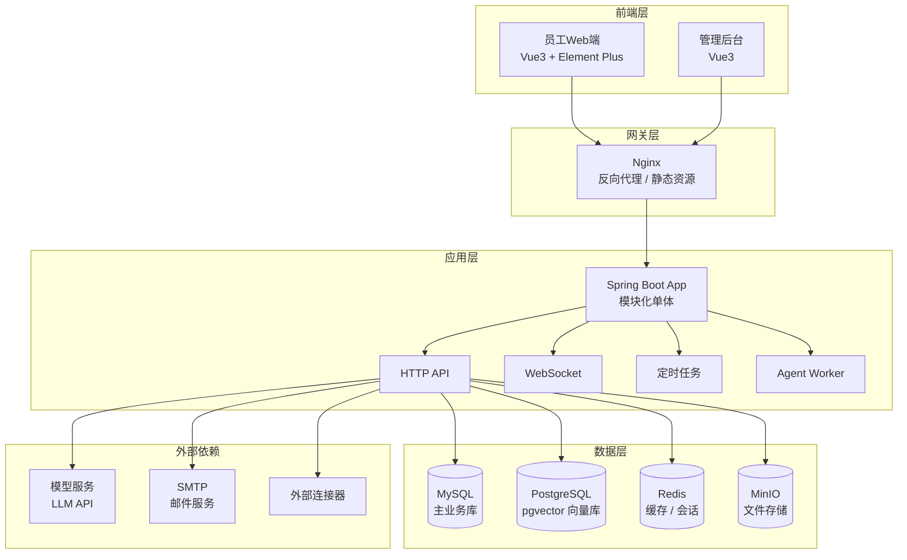

# 图1 · 系统总体架构拓扑

```mermaid
flowchart TD
    subgraph 前端层
        A1["员工Web端<br/>Vue3 + Element Plus"]
        A2["管理后台<br/>Vue3"]
    end

    subgraph 网关层
        B["Nginx<br/>反向代理 / 静态资源"]
    end

    subgraph 应用层
        C["Spring Boot App<br/>模块化单体"]
        C1["HTTP API"]
        C2["WebSocket"]
        C3["定时任务"]
        C4["Agent Worker"]
    end

    subgraph 数据层
        D1[("MySQL<br/>主业务库")]
        D2[("PostgreSQL<br/>pgvector 向量库")]
        D3[("Redis<br/>缓存 / 会话")]
        D4[("MinIO<br/>文件存储")]
    end

    subgraph 外部依赖
        E1["模型服务<br/>LLM API"]
        E2["SMTP<br/>邮件服务"]
        E3["外部连接器"]
    end

    A1 --> B
    A2 --> B
    B --> C
    C --> C1
    C --> C2
    C --> C3
    C --> C4
    C1 --> D1
    C1 --> D2
    C1 --> D3
    C1 --> D4
    C1 --> E1
    C1 --> E2
    C1 --> E3
```
