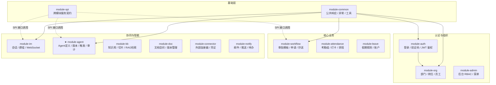

# 图2 · 后端模块划分与依赖关系

```mermaid
flowchart TD
    subgraph 基础层
        COM["module-common<br/>公共响应 / 异常 / 工具"]
        SPI["module-spi<br/>跨模块服务契约"]
    end

    subgraph 认证与组织
        AUTH["module-auth<br/>登录 / 验证码 / JWT 鉴权"]
        ORG["module-org<br/>部门 / 岗位 / 员工"]
        ADMIN["module-admin<br/>后台 RBAC / 菜单"]
    end

    subgraph 核心业务
        WF["module-workflow<br/>审批模板 / 申请 / 抄送"]
        ATT["module-attendance<br/>考勤组 / 打卡 / 排班"]
        LV["module-leave<br/>假期规则 / 账户"]
    end

    subgraph 协同与智能
        IM["module-im<br/>会话 / 群组 / WebSocket"]
        AGT["★ module-agent<br/>Agent定义 / 版本 / 触发 / 审计"]
        KB["module-kb<br/>知识库 / 切片 / RAG检索"]
        DOC["module-doc<br/>文档空间 / 版本管理"]
        CONN["module-connector<br/>外部连接器 / 凭证"]
        NOTIFY["module-notify<br/>邮件 / 推送 / 待办"]
    end

    COM --> AUTH
    COM --> ORG
    COM --> WF
    COM --> IM
    COM --> AGT
    AUTH --> ORG

    SPI -.->|"SPI 接口调用"| WF
    SPI -.->|"SPI 接口调用"| AGT
    SPI -.->|"SPI 接口调用"| IM
```
