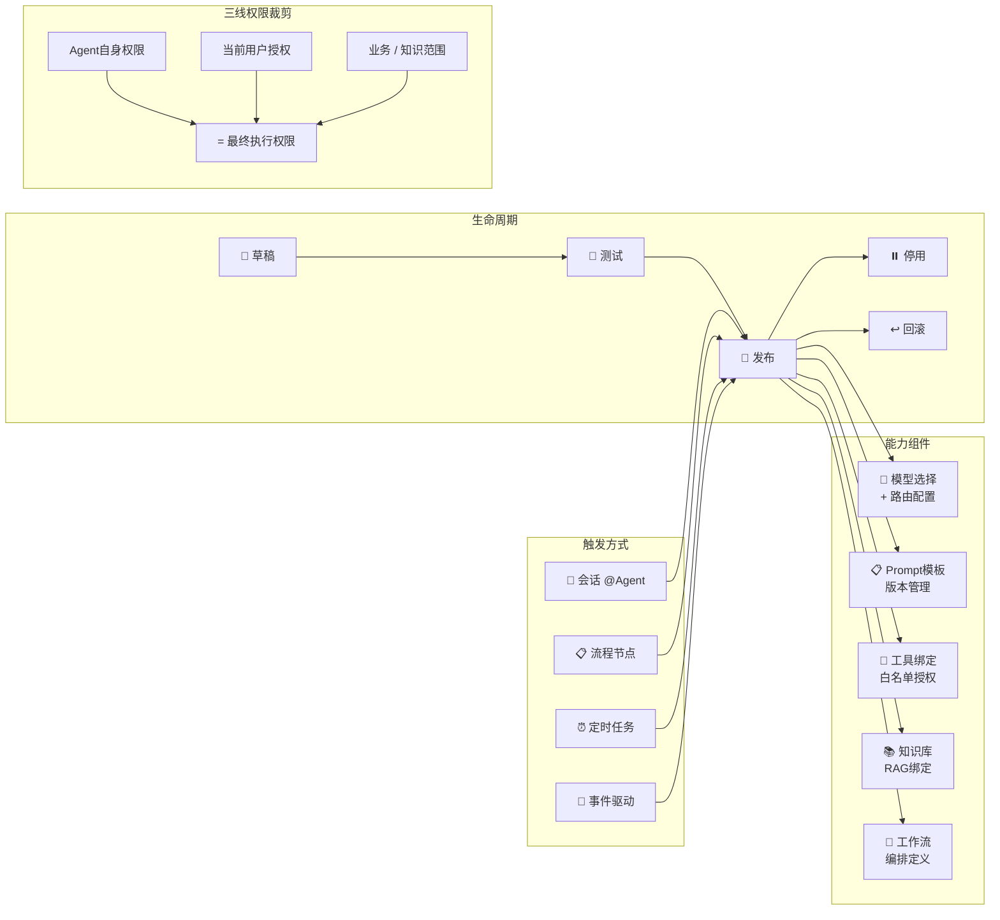

# 图3 · Agent平台内部架构（核心创新）

```mermaid
flowchart LR
    subgraph 生命周期
        L1["📝 草稿"] --> L2["🧪 测试"]
        L2 --> L3["🚀 发布"]
        L3 --> L4["⏸️ 停用"]
        L3 --> L5["↩️ 回滚"]
    end

    subgraph 能力组件
        L3 --> C1["🧠 模型选择<br/>+ 路由配置"]
        L3 --> C2["📋 Prompt模板<br/>版本管理"]
        L3 --> C3["🔧 工具绑定<br/>白名单授权"]
        L3 --> C4["📚 知识库<br/>RAG绑定"]
        L3 --> C5["🔄 工作流<br/>编排定义"]
    end

    subgraph 触发方式
        T1["💬 会话 @Agent"] --> L3
        T2["📋 流程节点"] --> L3
        T3["⏰ 定时任务"] --> L3
        T4["📡 事件驱动"] --> L3
    end

    subgraph 三线权限裁剪
        P1["Agent自身权限"]
        P2["当前用户授权"]
        P3["业务 / 知识范围"]
        P4["= 最终执行权限"]

        P1 --> P4
        P2 --> P4
        P3 --> P4
    end
```
