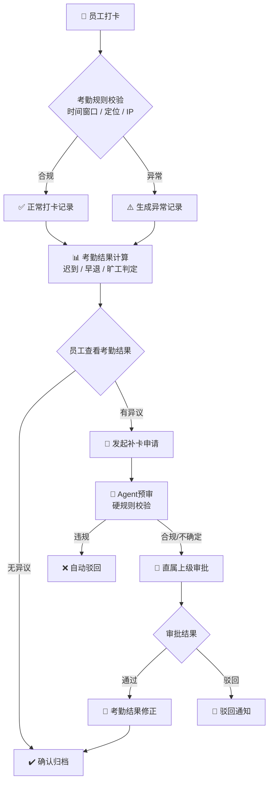

# 图4 · 核心业务流程（打卡 → 考勤 → 异常 → 补卡）

```mermaid
flowchart TD
    A["👤 员工打卡"] --> B{"考勤规则校验<br/>时间窗口 / 定位 / IP"}

    B -->|"合规"| C["✅ 正常打卡记录"]
    B -->|"异常"| D["⚠️ 生成异常记录"]

    C --> E["📊 考勤结果计算<br/>迟到 / 早退 / 旷工判定"]
    D --> E

    E --> F{"员工查看考勤结果"}

    F -->|"无异议"| H["✔️ 确认归档"]
    F -->|"有异议"| G["📝 发起补卡申请"]

    G --> I["🤖 Agent预审<br/>硬规则校验"]

    I -->|"违规"| J["❌ 自动驳回"]
    I -->|"合规/不确定"| K["👔 直属上级审批"]

    K --> L{"审批结果"}

    L -->|"通过"| M["🔄 考勤结果修正"]
    L -->|"驳回"| N["📩 驳回通知"]

    M --> H
```
