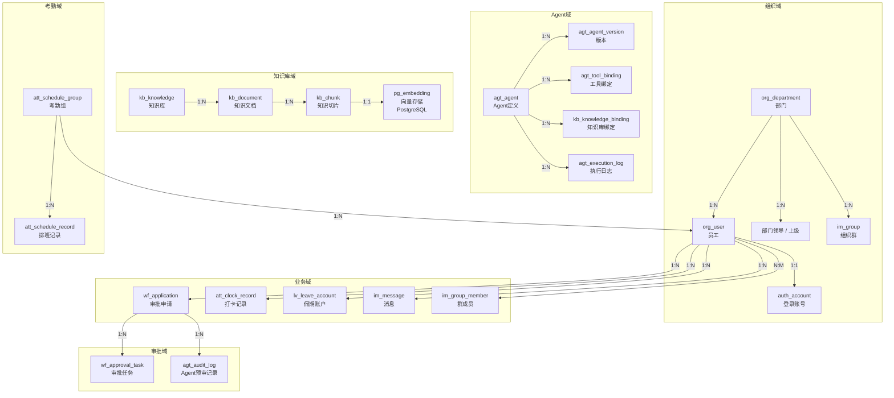

# 图5 · 核心数据域关系总览

```mermaid
flowchart TD
    subgraph 组织域
        DEPT["org_department<br/>部门"] -->|"1:N"| USER["org_user<br/>员工"]
        DEPT -->|"1:N"| LEADER["部门领导 / 上级"]
        DEPT -->|"1:N"| GROUP["im_group<br/>组织群"]
        USER -->|"1:1"| ACC["auth_account<br/>登录账号"]
    end

    subgraph 业务域
        USER -->|"1:N"| WFAPP["wf_application<br/>审批申请"]
        USER -->|"1:N"| CLOCK["att_clock_record<br/>打卡记录"]
        USER -->|"1:N"| LEAVEA["lv_leave_account<br/>假期账户"]
        USER -->|"1:N"| MSG["im_message<br/>消息"]
        USER -->|"N:M"| MEMBER["im_group_member<br/>群成员"]
    end

    subgraph 审批域
        WFAPP -->|"1:N"| TASK["wf_approval_task<br/>审批任务"]
        WFAPP -->|"1:N"| AUDIT["agt_audit_log<br/>Agent预审记录"]
    end

    subgraph Agent域
        AGENT["agt_agent<br/>Agent定义"] -->|"1:N"| VER["agt_agent_version<br/>版本"]
        AGENT -->|"1:N"| TOOL["agt_tool_binding<br/>工具绑定"]
        AGENT -->|"1:N"| KBBIND["kb_knowledge_binding<br/>知识库绑定"]
        AGENT -->|"1:N"| EXEC["agt_execution_log<br/>执行日志"]
    end

    subgraph 知识库域
        KNOW["kb_knowledge<br/>知识库"] -->|"1:N"| DOCU["kb_document<br/>知识文档"]
        DOCU -->|"1:N"| CHUNK["kb_chunk<br/>知识切片"]
        CHUNK -->|"1:1"| VEC["pg_embedding<br/>向量存储<br/>PostgreSQL"]
    end

    subgraph 考勤域
        SCHED["att_schedule_group<br/>考勤组"] -->|"1:N"| REC["att_schedule_record<br/>排班记录"]
        SCHED -->|"1:N"| USER
    end
```
